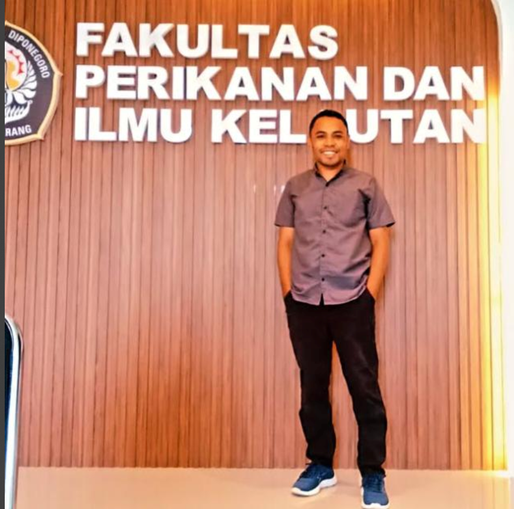

<html class="scroll-smooth" lang="id">
 <head>
  <meta charset="utf-8"/>
  <meta content="width=device-width, initial-scale=1" name="viewport"/>
  <title>
   Selamat Ulang Tahun Muhamat Sale Rumwokas
  </title>
  
  <link href="https://cdnjs.cloudflare.com/ajax/libs/font-awesome/5.15.3/css/all.min.css" rel="stylesheet"/>
  <link href="https://fonts.googleapis.com/css2?family=Poppins:wght@400;700&amp;display=swap" rel="stylesheet"/>
  
 </head>
 <body class="bg-gradient-to-br from-yellow-300 via-yellow-400 to-yellow-500 min-h-screen flex flex-col">
  <header class="bg-yellow-600 shadow-lg sticky top-0 z-50">
   <nav aria-label="Primary Navigation" class="container mx-auto px-6 py-5 flex justify-between items-center">
    <h1 class="text-white text-3xl font-extrabold tracking-widest drop-shadow-lg select-none">
     Ucapan Ulang Tahun
    </h1>
    <ul class="hidden md:flex space-x-10 text-yellow-100 font-semibold tracking-wide">
     <li>
      <a class="hover:text-white transition duration-300 ease-in-out transform hover:scale-110" href="#ucapan">
       Ucapan
      </a>
     </li>
     <li>
      <a class="hover:text-white transition duration-300 ease-in-out transform hover:scale-110" href="#riwayat">
       Riwayat
      </a>
     </li>
     <li>
      <a class="hover:text-white transition duration-300 ease-in-out transform hover:scale-110" href="#gallery">
       Galeri
      </a>
     </li>
     <li>
      <a class="hover:text-white transition duration-300 ease-in-out transform hover:scale-110" href="#kontak">
       Kontak
      </a>
     </li>
    </ul>
    <button aria-controls="mobile-menu" aria-expanded="false" aria-label="Toggle menu" class="md:hidden text-yellow-100 focus:outline-none" id="menu-btn">
     <i class="fas fa-bars fa-lg">
     </i>
    </button>
   </nav>
   

    <ul class="flex flex-col px-6 py-4 space-y-4 text-yellow-900 font-semibold tracking-wide">
     <li>
      <a class="block hover:text-yellow-700 transition" href="#ucapan">
       Ucapan
      </a>
     </li>
     <li>
      <a class="block hover:text-yellow-700 transition" href="#riwayat">
       Riwayat
      </a>
     </li>
     <li>
      <a class="block hover:text-yellow-700 transition" href="#gallery">
       Galeri
      </a>
     </li>
     <li>
      <a class="block hover:text-yellow-700 transition" href="#kontak">
       Kontak
      </a>
     </li>
    </ul>
   

  </header>
  <main class="flex-grow container mx-auto px-6 py-16">
   <section class="text-center max-w-4xl mx-auto mb-20 bg-yellow-50 bg-opacity-80 rounded-3xl p-10 shadow-2xl border border-yellow-300" id="ucapan">
    <h2 class="text-5xl md:text-6xl font-extrabold text-yellow-900 mb-8 drop-shadow-md">
     Selamat Ulang Tahun,
      
     
      Muhamat Sale Rumwokas!
     
    </h2>
    
    

     Muhamat Sale Rumwokas, panutan yang luar biasa! Semoga hari ulang tahunmu
     dipenuhi dengan kebahagiaan, cinta, dan keberkahan. Teruslah menjadi
     inspirasi bagi semua orang di sekitarmu.
    

    

     Dari Ade Ikhi, selalu mendukungmu dari Jakarta Pusat.
    

   </section>
   <section class="max-w-5xl mx-auto mb-20 bg-yellow-50 bg-opacity-80 rounded-3xl p-10 shadow-2xl border border-yellow-300" id="riwayat">
    <h3 class="text-4xl font-extrabold text-yellow-900 mb-12 text-center drop-shadow-md">
     Perjalanan dan Kenangan
    </h3>
    

     <article class="bg-yellow-200 rounded-2xl p-8 shadow-lg border border-yellow-300 hover:scale-105 transition-transform duration-300">
      <h4 class="text-2xl font-bold text-yellow-800 mb-4">
       Awal Perjalanan
      </h4>
      

       Muhamat Sale Rumwokas memulai perjalanan hidupnya dengan penuh semangat
       dan tekad yang kuat. Dari Jakarta Pusat, beliau selalu menjadi panutan
       bagi keluarga dan teman-teman.
      

     </article>
     <article class="bg-yellow-200 rounded-2xl p-8 shadow-lg border border-yellow-300 hover:scale-105 transition-transform duration-300">
      <h4 class="text-2xl font-bold text-yellow-800 mb-4">
       Momen Terbaik
      </h4>
      

       Banyak momen berharga yang telah dilalui, mulai dari keberhasilan dalam
       karir hingga kebersamaan dengan orang-orang tercinta. Setiap langkahnya
       selalu menginspirasi.
      

     </article>
     <article class="bg-yellow-200 rounded-2xl p-8 shadow-lg border border-yellow-300 hover:scale-105 transition-transform duration-300">
      <h4 class="text-2xl font-bold text-yellow-800 mb-4">
       Harapan ke Depan
      </h4>
      

       Semoga di tahun-tahun mendatang, Muhamat Sale selalu diberikan
       kesehatan, kebahagiaan, dan kesuksesan yang berlimpah. Teruslah menjadi
       panutan yang hebat!
      

     </article>
    

   </section>
   <section class="max-w-7xl mx-auto mb-20 bg-yellow-50 bg-opacity-80 rounded-3xl p-10 shadow-2xl border border-yellow-300" id="gallery">
    <h3 class="text-4xl font-extrabold text-yellow-900 mb-12 text-center drop-shadow-md">
     Galeri Kenangan
    </h3>
    

     
     
     
     
     
     
     
     
    

   </section>
   <section class="max-w-3xl mx-auto text-center mb-16 bg-yellow-50 bg-opacity-80 rounded-3xl p-10 shadow-2xl border border-yellow-300" id="kontak">
    <h3 class="text-4xl font-extrabold text-yellow-900 mb-8 drop-shadow-md tracking-wide">
     Kontak Ade Ikhi
    </h3>
    

     Jika ingin mengirimkan ucapan atau pesan khusus untuk Muhamat Sale
     Rumwokas, silakan hubungi:
    

    

     <i class="fas fa-envelope">
     </i>
     <a class="hover:underline hover:text-yellow-700 transition duration-300" href="mailto:adeikhi@example.com">
      adeikhi@example.com
     </a>
    

    

     <i class="fas fa-phone-alt">
     </i>
     <a class="hover:underline hover:text-yellow-700 transition duration-300" href="tel:+628123456789">
      +62 82237787869
     </a>
    

   </section>
  </main>
  <footer class="bg-yellow-600 text-yellow-100 py-8 text-center font-semibold tracking-wide select-none drop-shadow-md">
   © 2024 Ade Ikhi - Ucapan Selamat Ulang Tahun untuk Muhamat Sale Rumwokas
  </footer>
  
 </body>
</html>
